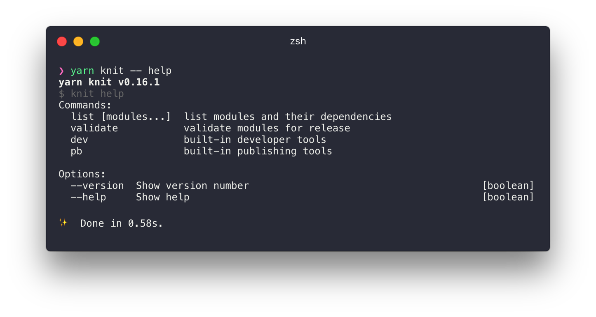

---

KnitJS is a set of tools to help simplify development and publishing of JS [multi-package repositories](https://github.com/babel/babel/blob/master/doc/design/monorepo.md).

**Fast:** Uses Yarn to install dependencies and only needs to install once rather than in each module.

**Simple:** Uses built-in node package resolution so there doesn't have to be a bootstrap step.  

**Compatible** Uses a single `package.json` for dependencies so knit repos are compatible with external tools.

- [Features](#features)
- [Install](#install-knit)
- [Getting Started](#getting-started)
- [Usage](#usage)
- [CLI Commands](#cli-commands)
- [Node API](#node-api)
- [Prior Art](#prior-art)

## Features

- Reduced overhead when working with Monorepos
- Uses a single root level `package.json` for package management meaning Knit works with tools like [Yarn](https://yarnpkg.com/), [flow-typed](https://github.com/flowtype/flow-typed), [Greenkeeper](https://greenkeeper.io/).
- Meta data is stored in the root `package.json` rather than duplicated in each module.
- No bootstrap step needed to link modules
- Dependency versions are defined globally and so stay in sync across modules
- Auto discovery of missing and unused dependencies
- Simple [core](https://github.com/knitjs/knit/tree/master/modules/node_modules/%40knit/knit-core) library for building tools around
- Powerful (but optional) tools for developing and publishing apps or libraries
- Supports commonjs, es6 modules and umd as build targets

## Install

You should have the following programs installed before starting:

 - [git](https://git-scm.com/)
 - [yarn](https://yarnpkg.com/)

It is recommended that knit be installed globally but it can also work as a local package using npm scripts.

#### Global

```
yarn global add @knit/knit
```

#### Local

```
yarn add @knit/knit
```

```
// package.json
{
  ...
  "scripts": {
    ...
    "knit": "knit"
  }
}
```



## Getting Started

See our [create-knit-app](https://github.com/knitjs/knit/tree/master/modules/node_modules/create-knit-app) for instructions on getting started.

## CLI

For a full list of commands see the cli documentation [here](https://github.com/knitjs/knit/tree/master/modules/node_modules/%40knit/knit)

## Node API

For a full list of methods see the Node API documentation [here](https://github.com/knitjs/knit/tree/master/modules/node_modules/%40knit/knit-core)

## Prior Art

Of course Knit wasn't created in a vacuum and is inspired by and makes use of many amazing tools:

- [Yarn](https://yarnpkg.com/) - awesomely fast new package manager for node. Creating a monorepo build tool that could work with yarn was the reason this project was started.
- [Lerna](https://lernajs.io/) - inspiration for the idea that monorepos could be a thing
- [Alle](https://github.com/boennemann/alle) - amazing set of ideas that resonated with our experiences on how to make monorepo development better and easier.
- [Depchek](https://github.com/depcheck/depcheck) - at the heart of the dependency resolution. Great library and extremely easy to [extend](https://github.com/knitjs/knit/tree/master/modules/node_modules/%40knit/depcheck)
